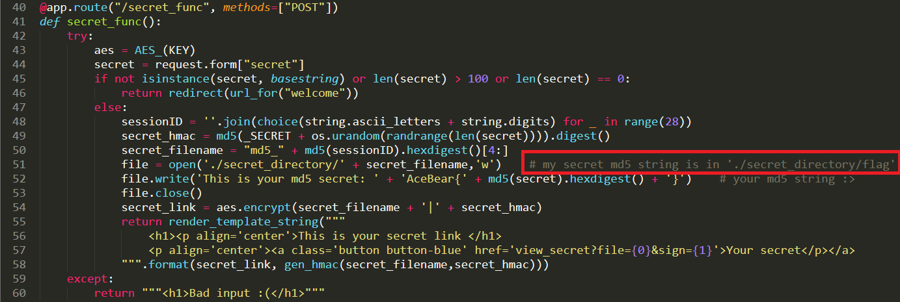

md5Converter
============

### Info
 - Original Link: [http://md5convert.whitehat.vn:12345](http://md5convert.whitehat.vn:12345)
 - Flag: `AceBear{fl1pp1ng_and_fake_HMAC_SECRET__for_a_warm_Up_Challenge___^_^}`

### What do we have?

 - We arrive at a landing page that allows us to submit a secret

 - We submit the word "test" and get presented with a page that shows us a link to our secret

 - We click the link and and it shows what appears to be an MD5 of our secret

### Let's solve it

 - We can view the source of the landing page and scroll right to teh bottom to find something interesting, a potential link

 - We visit the secret URL and view the page source
 - Bingo, we've found something hopefully useful!
 - The full snapshot of the code can be seen [here](some_thing_interesting.html)
 - It's clear we're dealing with a website written in Python, the full code of which is here

 - A quick review of the source code reveals a helpful comment that tells us WHERE the flag is hidden, it's hidden in a file called `flag` that we need to find

 - This is the function that allows us to retrieve files, based on the AES encrypted string
 - There must be a flaw SOMEWHERE in this function that allows us to ultimately secure the flag

 - We can see the RAW request to create a secret here
 - Creating a secret here results in the server sharing us a URL with a `file` and `sign` parameter

 - At point `1` We can see that a random sessionID is created using the Python random library, it's unlikely we can attack this
 - That random sessionID is then run through the MD5 algorithm generating an md5 in the form of `xxxxxxxxxxxxxxxxxxxxxxxxxxxxxxxx`
 - The md5 is appended to the string `md5_`
 - This results in a file called `md5_xxxxxxxxxxxxxxxxxxxxxxxxxxxxxxxx` being created
 - At point `2` we can see that the filename from above is concated with `|` and then a HMAC of the filename itself
 - This means, we ultimately need to change this to read `flag|<HMAC of flag>` within the AES encrypted payload
 - At this point, lets see how the AES encryption is done, maybe it's the standard Python library, maybe it's not

 - On line `17` we can see that an IV is randomly generated
 - We can see that the payload is encrypted using this IV and some key that we don't really know
 - Line `19` shows that the IV and the encrypted payload are both returned
 - BINGO! We can manipulate the IV to change the contents of the decrypted plaintext using MAGIC, let me explain

 - This is a classic diagram of how AES CBC works, let me give you the simple mans explanation
 - AES is a block cipher, meaning that it breaks all of your data into fixed blocks, and encrypts them block by block
 - We will look at this from the perspective of decryption, as it's more relevant for our use case
 - The first block is decrypted using the key, which results in some garbage text, then, that garbage text is XORed with the IV which results in the original plaintext
 - Regardless of what key is used, the plaintext is directly related to the IV
 - We know that the first 4 characters of the string are going to be md5_
 - If we modify the first 4 characters of our IV, we can directly change what md5_ translates into, not only that, we can do it in a very predictable manor, so much so, that we can convert these 4 characters into `flag` trivially
 - We know that the next character should also be a pipe symbol `|` and then the HMAC

 - Here it is, a huge logic flaw in the entire process, can you spot it?
 - We split the AES decrypted string on the pipe `|` character
 - The first part is the filename, and the second part is the SECRET that is used to generate the HMAC :O
 - What if we did `flag||`, that would mean the file would be `flag` and then the HMAC secret would be `<blank>`, we can compute the HMAC of `flag` and a blank secret, we have the HMAC generation function as part of this code, that is EASY
 - Trouble is, we only know the first `4` characters of the plaintext, the next 32 characters are random
 - The characters can be `0-9a-f` -- that's `16` possible characters
 - We need to guess `2` characters, and there is `16` choices for each -- `16 x 16 = 256` -- We can solve this with 256 guesses :O That's reasonable!
 - I was able to calcualte the HMAC for the `flag` and a blank IV, it came out to be `f7101d3ad5cb2622672fb15e079d8db3`, the python code was provided via that source code above, it's trivially to do

 - I wrote a quick NodeJS program which generates all `256` possibilities, the source code of which can be seen [here](md5_convert.js)
 - I loaded up BURP and set the target payload position to be the `file` parameter, and plugged in our known HMAC
 - Press GO and hope for the best

 - It made it's way through our possible guesses, and guess number `92` look different
 - BINGO, that's our flag!

### Something Extra
 - I really enjoyed this puzzle and felt super fullfilled when I solved it